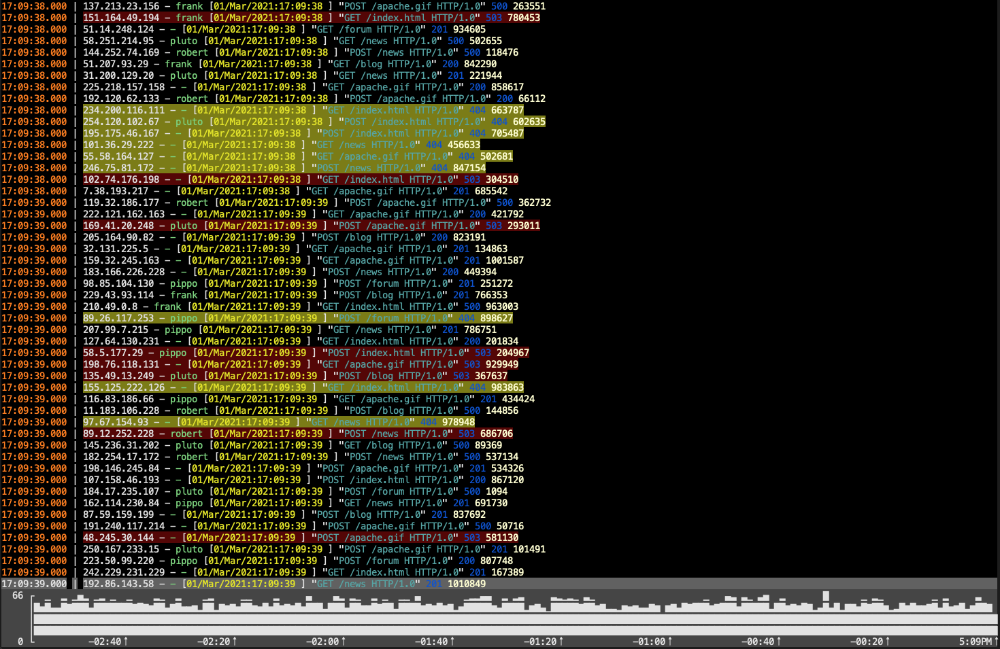

# LogView widget for cview

LogView widget for [tview](https://github.com/rivo/tview). It will also work with [cview](https://gitlab.com/tslocum/cview),
just replace import.

## Rationale

cview/tview TextView widget tries to recalculate highlighting and wrapping on every new line appended to the widget. Batch appends helps a little, but I was not able to achieve acceptable performance even when the line count in TextView's buffer was set to as little as 500.

LogView is designed for logs, so it supports very fast append operation and takes special care to calculate highlighting and line wrapping only once for each log event added.

LogView operates on LogEvent structures, not on text lines, this allows keeping track of which line belongs to which event even with wrapping enabled and easy navigation to specific log event by its ID or timestamp.

## Capabilities

LogView supports:

- [x] tailing logs
- [x] limiting the number of log events stored in log view
- [x] highlighting error/warning events (with customizable colors)
- [x] custom highlighting of parts of log messages
- [x] scrolling to event id
- [x] scrolling to timestamp
- [x] optional display of log event source and timestamp separately from main message
- [x] keyboard and mouse scrolling
- [x] selection of log event with a keyboard or mouse with a callback on selection change 
- [x] merging of continuation events (i.e. multiline java stack-traces can be treated as one log event)
- [x] velocity graph

## Performance notes

LogView attempts to minimize the number of calculations performed. For each log event, the line wrapping and colour
highlighting are calculated only once, at the moment the event is appended to the log view. This allows for very
fast appends, but also means the whole log view can become stale if widget size or colour settings change.

Widget size changes are handled automatically. If line wrapping is disabled, then no additional work has to be done, otherwise
line wrapping are recalculated as needed.

Recalculating highlights changes is a more expensive operation, so it is not handled automatically. To force recalculation
of highlights for all the log events call `LogView.RefreshHighlighs()` method.

Changes to any of the highlights or default Log view style would require recalculation. Changes to the background colour of
current event or error and warning level events do not require recalculation.
## LogVelocityView Widget

Log velocity widget displays bar chart of number of log events per time period. Widget can show count for all events or
only events of the certain level.

Note. Many fonts will have weird line gaps in the block characters. Hack is one of the best in this regard.